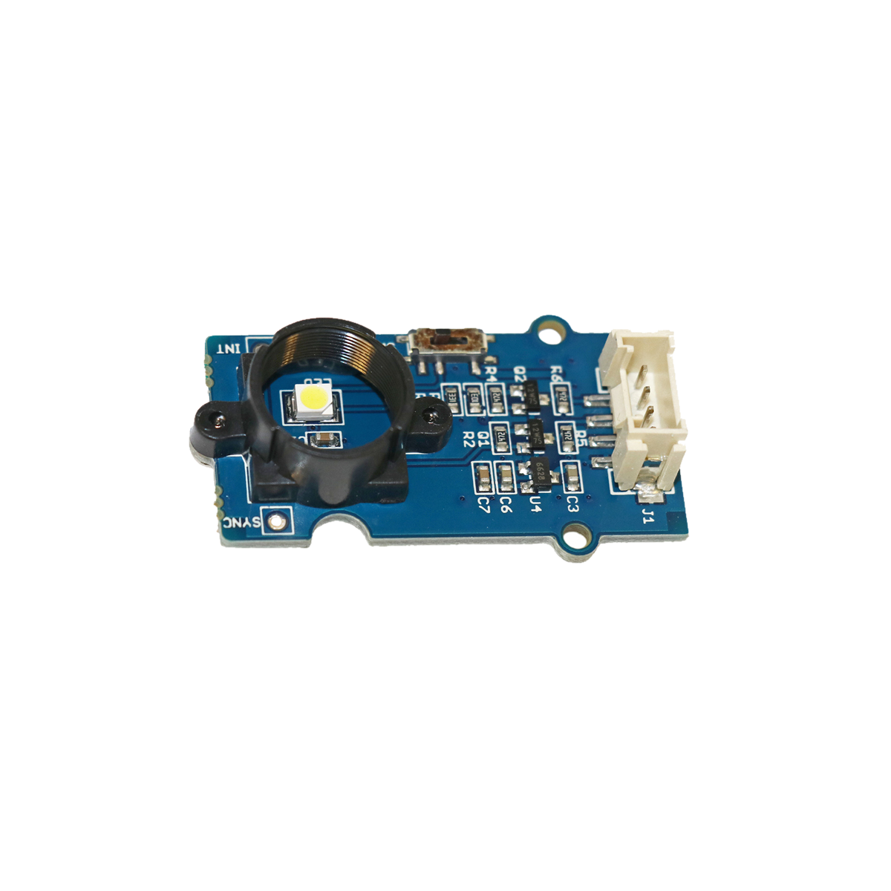

# Farbsensor

## Beschreibung
Der Farbsensor kann Farben sowohl von Lichtquellen als auch von Gegenständen ermitteln. Um die Erkennung zu verbessern, kann der Sensor mit einer externen gepulsten Lichtquelle synchronisiert werden. Die erkannte Farbe wird in RGB-Werten ausgegeben. Der Sensor wird direkt oder mithilfe des Grove Shields an einen Arduino oder Raspberry Pi angeschlossen. Er kommuniziert über die serielle Schnittstelle I2C.

Alle weiteren Hintergrundinformationen, sowie ein Beispielaufbau und alle notwendigen Programmbibliotheken sind auf dem offiziellen Wiki (bisher nur in englischer Sprache) von Seeed Studio zusammengefasst. Zusätzlich findet man über alle gängigen Suchmaschinen durch die Eingabe der genauen Komponentenbezeichnungen entsprechende Projektbeispiele und Tutorials.

Die genaue Bezeichnung des Sensors, die bei der Suche von Beschreibungen und Anleitungen wichtig sein kann, lautet TCS3414CS.

<!-- infolist -->

<!-- infolists -->
## Wichtige Links für die ersten Schritte:

- [Seeed Studio Wiki](http://wiki.seeedstudio.com/Grove-I2C_Color_Sensor/) [- Farbsensor](http://wiki.seeedstudio.com/Grove-I2C_Color_Sensor/)

## Projektbeispiele:

- [Makerblog - Beispielhafte Farberkennung](https://www.makerblog.at/2015/01/farben-erkennen-mit-dem-rgb-sensor-tcs34725-und-dem-arduino/)

## Weiterführende Hintergrundinformationen:

- [I2C - Wikipedia Artikel](https://de.wikipedia.org/wiki/I%C2%B2C)
- [SPI - Wikipedia Artikel](https://de.wikipedia.org/wiki/Serial_Peripheral_Interface)
- [UART - Wikipedia Artikel](https://de.wikipedia.org/wiki/Universal_Asynchronous_Receiver_Transmitter)
- [RGB-Farbraum - Wikipedia Artikel](https://de.wikipedia.org/wiki/RGB-Farbraum)
- [GitHub-Repository: Farbsensor](https://github.com/MakeYourSchool/35-Farbsensor)

